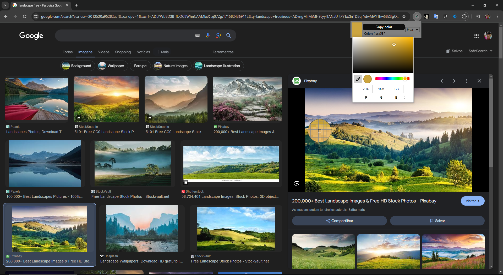
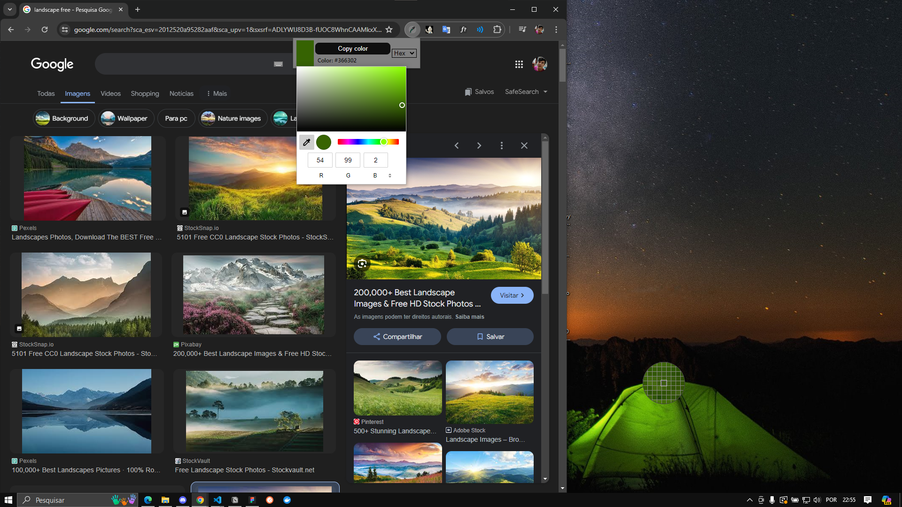

## **📌** Sobre

 Essa extensão permite ao usuário identificar uma cor em qualquer lugar da tela(pode ser utilizada para pegar cores de fora do chrome) e copiar o código hexadecimal/RGB/HSL correspondente com apenas um clique no botão fornecido pela extensão.

## Como utilizar

1. Abra o link da extensão e adicione ela ao seu navegador
2. Abra o gerenciador de extensões no canto superior direito e clique no icone da extensão
3. É recomendavel fixar a extensão para utilizar com mais facilidade
4. Após clicar no icone irá abrir o pop-up da extensão e para utilizar basta clicar no retangulo colorido
5. Então poderá escolher uma cor, ou clicar no conta-gotas e selecionar algum pixel da tela para pegar o código da cor
6. Após gerar o código basta clicar em copy color e o valor do código da cor já poderá ser colado utilizando ctrl + v

## 🔗 Link

[Link da página da extensão da loja do chrome](https://chromewebstore.google.com/detail/color-picker/cpkidjbnngpahjhofgbgbjkhenipbdjo)

## 💻 Exemplo do projeto
